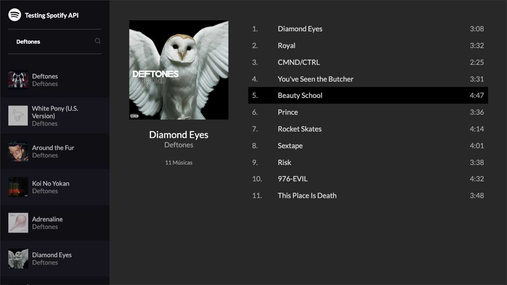

# Testing Spotify API

## This is a study using the Spotify lib

This project was developed during the [JS COM TDD NA PRÁTICA](https://www.udemy.com/course/js-com-tdd-na-pratica) course.
I made some changes to the original content. I preferred to use `yarn` instead of `npm` and updated webpack and customized eslint.

## How to run?

First you need to go to Spotify Developers API and create your Token. Then add your token on src/spotify.js.
PS: Remember that the token will expire in 60min and each song will play for only 30 seconds.

Install the dependecies and run the application with `yarn && yarn start`

## Something in the future?

- [ ] Show 30 seconds countdown
- [ ] Show playlists and podcasts
- [ ] Responsive layout
- [ ] More tests

